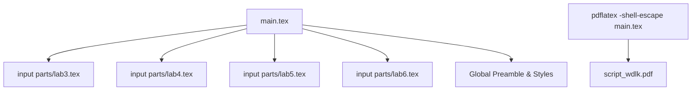

# Plan: LaTeX Document Assembly and Compilation

The goal is to create a master LaTeX file `main.tex` in `latex/script/` that includes multiple parts from the `parts/` subdirectory and then compile it into `script_wdlk.pdf`.

## Proposed `main.tex` Structure

The `main.tex` file will contain the global preamble (packages, styles, configurations) and use `\input{parts/filename.tex}` for each section.

### Parts to include:
1. `parts/lab3.tex`
2. `parts/lab4.tex`
3. `parts/lab5.tex`
4. `parts/lab6.tex`

### Handling of Sub-files:
Since the sub-files currently contain their own `\documentclass` and `\begin{document}` blocks, they will need to be cleaned up (stripped of preambles and document environment) to be properly included via `\input`. However, the task specifically asks to use `\input{parts/nazwa_pliku.tex}`. To make this work without modifying the parts (if possible) or by minimally modifying them, we have two options:
1. **Strip parts:** Remove headers/footers from `labX.tex` files.
2. **Use `standalone` package:** This allows `\input`ing files that have their own preambles.

**Decision:** I will plan to strip the `\documentclass`, preamble, and `\begin{document}`/`\end{document}` from the `parts/*.tex` files to ensure a clean merge, as `\input` literally pastes the content. Alternatively, I can use the `docmute` or `standalone` package in `main.tex` to ignore the preambles of the included files.

## Compilation Strategy
I will use `pdflatex` (or `latexmk` if available) with the `-shell-escape` flag because the documents use the `minted` package for code highlighting.

## Mermaid Diagram of the Process

## TODO List Refinement
1. [ ] Strip `\documentclass` and document environments from `parts/lab3.tex`, `parts/lab4.tex`, `parts/lab5.tex`, and `parts/lab6.tex`.
2. [ ] Create `latex/script/main.tex` with the combined preamble and `\input` statements.
3. [ ] Execute compilation command: `pdflatex -shell-escape -jobname=script_wdlk main.tex`.
4. [ ] Verify `script_wdlk.pdf` is generated.
